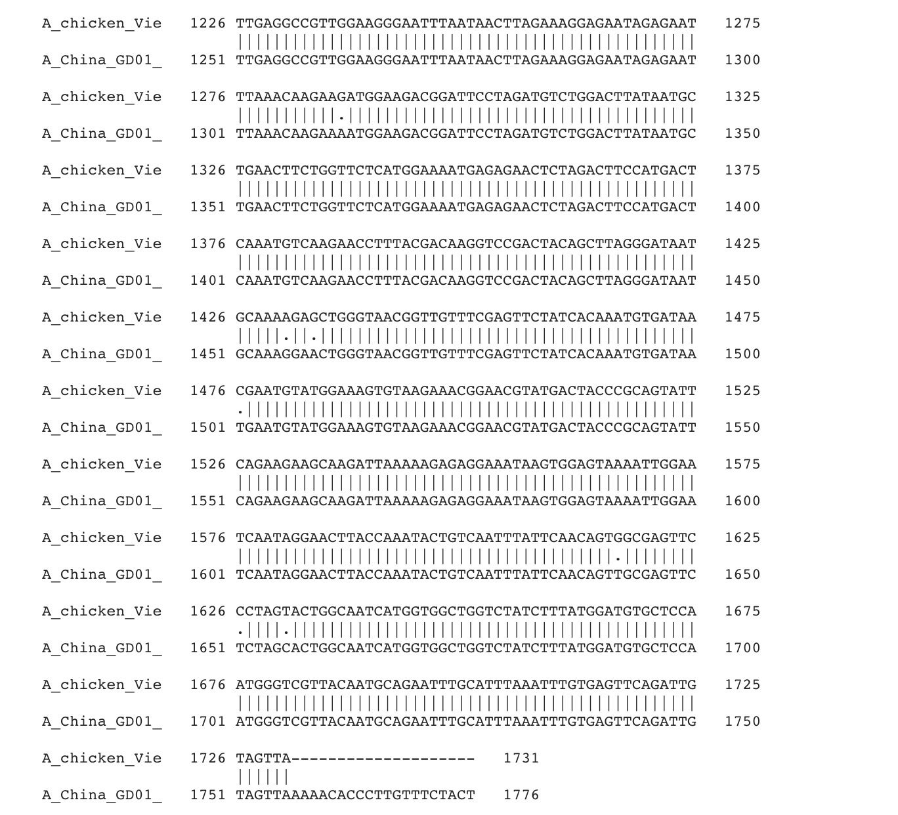
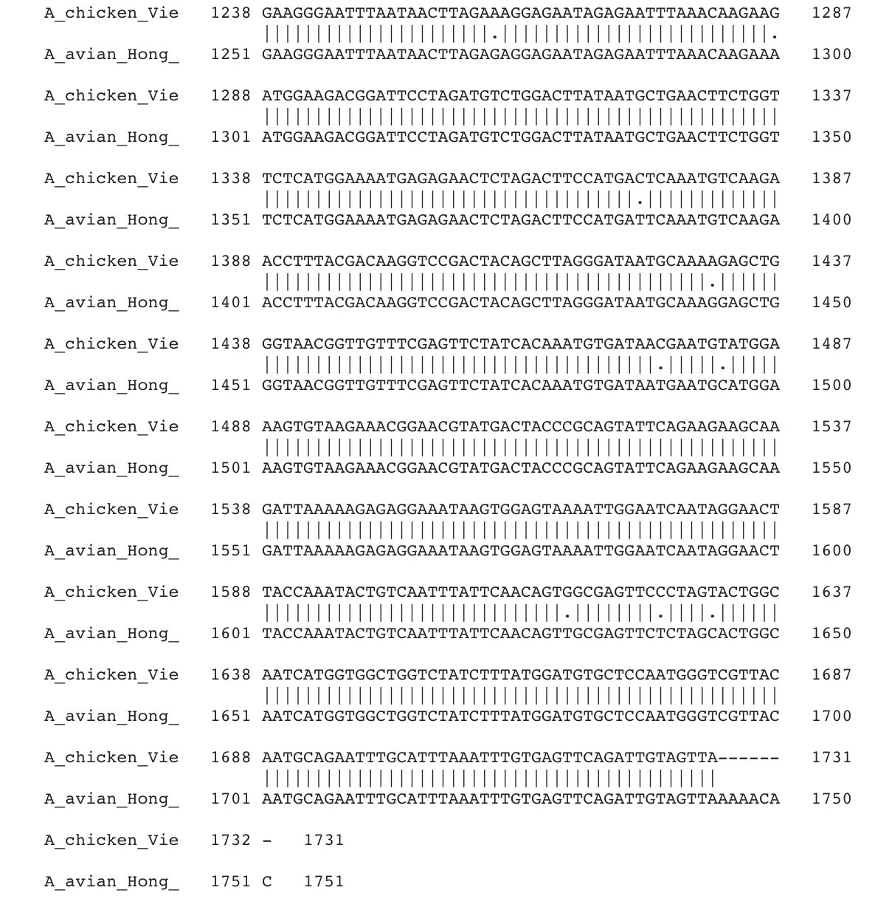
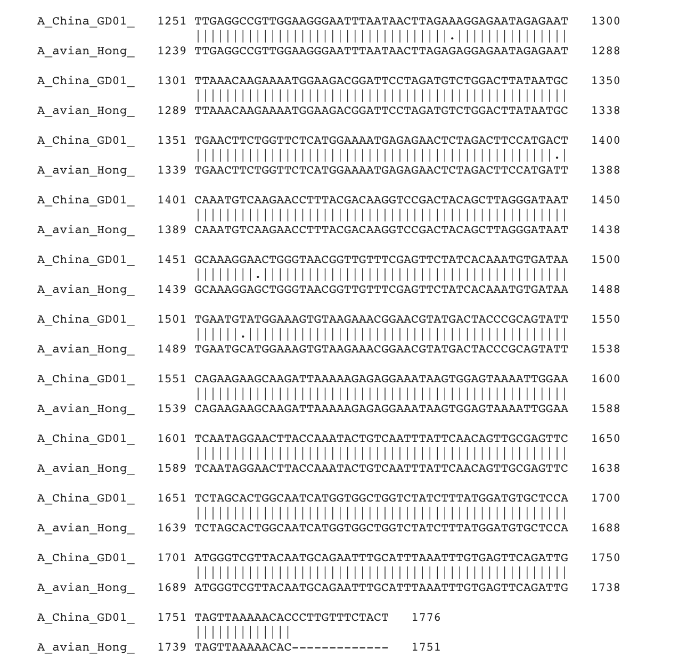
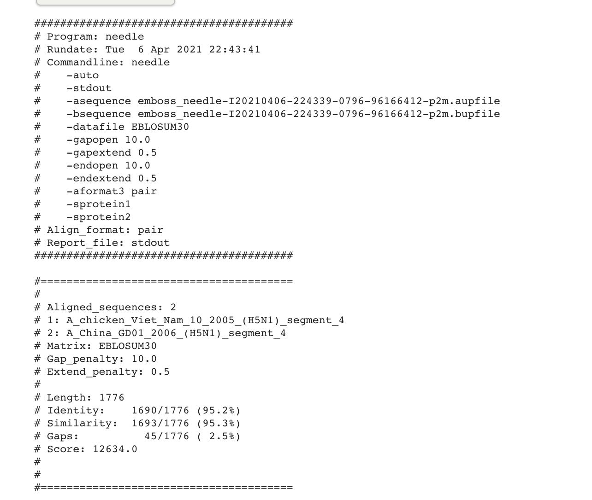
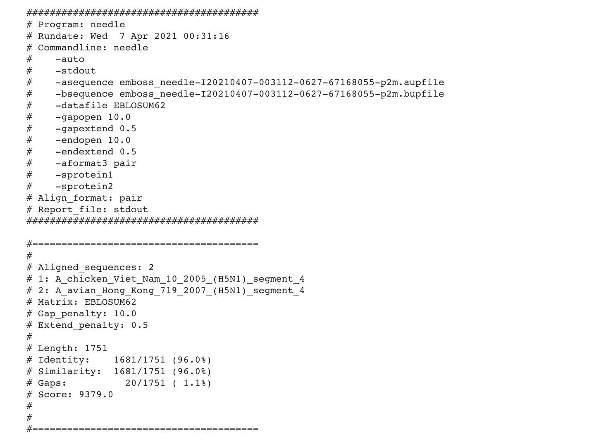
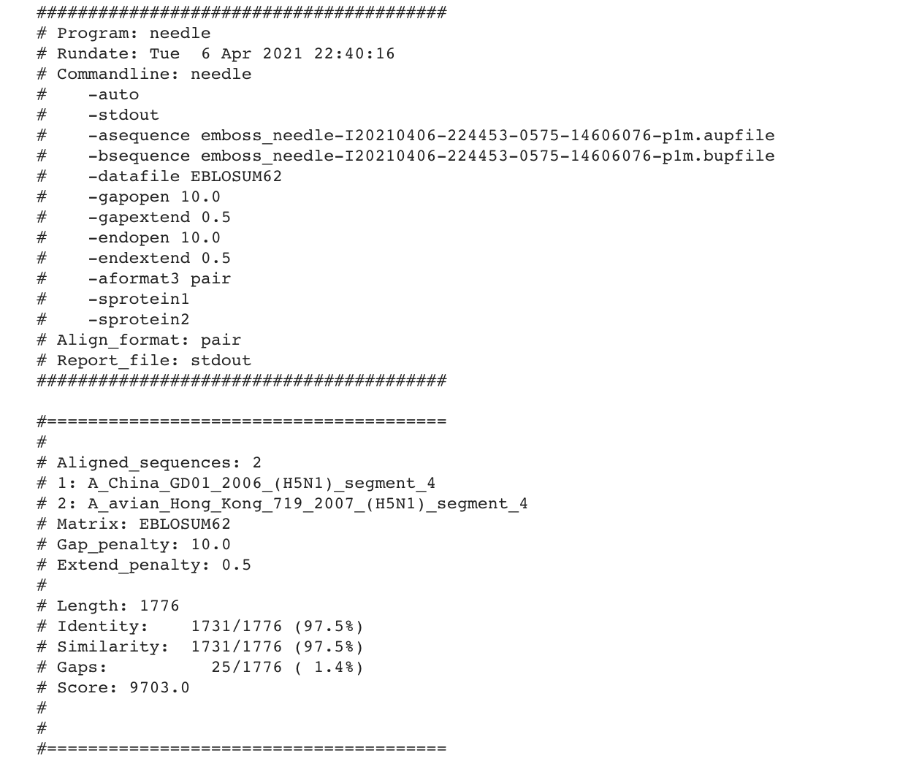

#### Name: Cory Wiard
#### Date: 29 March 2021
#### What this is: Questions in blue from the assignment sheet.

#### Part 1.

 1. Which software did you use to conduct your analysis?

The software that I used to conduct my analysis was from the link:
http://experiments.mostafa.io/public/needleman-wunsch/. This is an online
interactive demo that was selected.

 2. How similar were the two sequences (`s1.fasta` and `s2.fasta`) which you applied an alignment program?

 The two sequences were fairly similar. They saw many different cases where there was a
 match. This was when looking at the best case where the sequences were lined up
 together. Whenever each individual went through every case of the other sequence
 there was not great luck. In the direct center Diagonally there was similarity, but
 every where else there was not. However, the alignment score was very low at equal to
 one. I feel this is because of the gap score being -2.

 3. Are the two sequences closely related to each other, in your opinion?

 In my opinion they are not closely related. The middle portion where the alignment
 is made they are similar, but everywhere else they are not.

 4. What proof do you have to suggest such a claim?

The proof I have to suggest this is due to their low alignment score. The score was
equal to one, which is very low. This could be because the default gap score is
-2. Whenever I changed it to -1 the alignment score jumped to 8.

#### Part 2
 1. How much similarity exists between each of the sequences to the others?

All of the sequences are very similar until the very end of their sequence. Each one
has very high scores and most of the sequence is a match. It isn't until the very end
that any separation is seen from the sequences.

 2. Based on your results so far (which are too few to provide a comprehensive study), do you believe there is evidence that human adaptation is occurring in H5N1 viruses that might merit concern about human-to-human transmission in the near future?

I think the argument can be made that there is some adaptation occurring. If this is
the case it is on a very very small level. The reason I say this is because of the
changes in alignment score. We see two scores in the 9000 range and then one in the
12000 range. This tells me that the 12000 range is very similar but the other two
are a bit different. This tells me that something in
A_avian_Hong_Kong_719_2007_(H5N1)_segment_4 changes from the other two that it drops
the score by 3000.

 3. Statistics: What were the numbers of Lengths, Similarities, Gaps and Scores for each of your alignment tasks?

 
 
 

 Aligned_sequences: 2
  1: A_chicken_Viet_Nam_10_2005_(H5N1)_segment_4
  2: A_avian_Hong_Kong_719_2007_(H5N1)_segment_4
  Matrix: EBLOSUM62
  Gap_penalty: 10.0
  Extend_penalty: 0.5

  Length: 1751
  Identity:    1681/1751 (96.0%)
  Similarity:  1681/1751 (96.0%)
  Gaps:          20/1751 ( 1.1%)
  Score: 9379.0

 Aligned_sequences: 2
 1: A_China_GD01_2006_(H5N1)_segment_4
 2: A_avian_Hong_Kong_719_2007_(H5N1)_segment_4
 Matrix: EBLOSUM62
 Gap_penalty: 10.0
 Extend_penalty: 0.5

 Length: 1776
 Identity:    1731/1776 (97.5%)
 Similarity:  1731/1776 (97.5%)
 Gaps:          25/1776 ( 1.4%)
 Score: 9703.0

 Aligned_sequences: 2
  1: A_chicken_Viet_Nam_10_2005_(H5N1)_segment_4
  2: A_China_GD01_2006_(H5N1)_segment_4
  Matrix: EBLOSUM30
  Gap_penalty: 10.0
  Extend_penalty: 0.5

  Length: 1776
  Identity:    1690/1776 (95.2%)
  Similarity:  1693/1776 (95.3%)
  Gaps:          45/1776 ( 2.5%)
  Score: 12634.0

(Did you remember to add your name to this Markdown file?)
